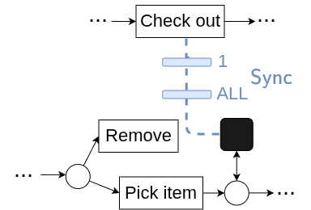
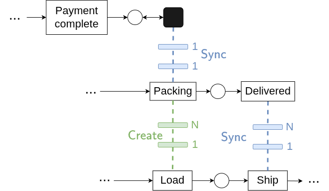

# Simulating Dynamic Relationships in Object-Centric Processes

## Installation guide

To execute this code, use **Python 3.10** and install the following main packages:

* scikit-learn==1.2.1
* scipy==1.11.2
* simpy==4.0.1
* pm4py==2.7.5.2
* statsmodels==0.14.0
* pandas==1.5.3

or you can use the configuration file called requirements.txt to install all specified package versions.

```shell
pip install -r requirements.txt
```

## Getting Started

Once the packages are installed, <ins>inside the core folder</ins> you can run one or more simulations by specifying the following parameters in *main* function of *run_simulation.py*.
* `path_parameter`: specify the path to the simulation parameter file, in *json* format
* `name`: name of the process to run
* `n_simulation`: specify the total number of simulation to run

```shell
python run_simulation.py
```


## Input files

This document explains how to configure and fix parameters for each object type in the process, for instance *truck, order, item* of the motivating example.

"start_simulation": "YYYY-MM-DD HH:MM:SS" : global start of simulation

Then for each object insert that information:

| Field | Type / Example | Explanation |
|------|----------------|-------------|
| object_name | string (key) | Name of the object, used to distinguish different objects and specify the channel |
| n_objects | int | Number of object indentifiers to generate in the simulation |
| path_petrinet | string (path) | Path to the Petri net associated with this object |
| interTriggerTimer | object / dict | Distribution describing the arrival time of the object in the simulation |
| processing_time | object / dict | Assignment of processing times for all transitions in the Petri net as distribution functions |
| waiting_time | object / dict | Optional assignment of waiting times for transitions in the Petri net as distribution functions |
| resource | object / dict | Resources involved in the execution of this object |
| resource_table | object / dict | Allocation rules between resources and transitions |
| probability | object / dict | Probability associated with each decision point, or *CUSTOM* to define a specific rule in the *custom_function.py* file |
| generator_by | list / array | Indicates if the object is generated by another object; in this case, *interTriggerTimer* and *n_objects* are ignored |
| task_generator | object / dict | Specifies whether any transition can generate another object, including the object type and the distribution used |
| generate | list / array | List of objects type that can be generated |
| object_constraints | object / dict | Specifies synchronization channels, rules, and involved transitions |
| create_relation_ship | object / dict | Specifies transitions linked to a creation channel that establish relationships |
| destroy_relation_ship | object / dict | Specifies transitions linked to a channel that remove relationships |


This block defines all configuration parameters for a simulation object, including its creation, timing, resources, behavior, and relationships with other objects; detailed examples and exact usage can be found in the files inside the input_folder.

### Additional specification
Here additional example are provided to simplify the specification of the parameters in the input file. 

1. Create channel 1:N between *order* and *item*. Transition *Place order* and *Add items* spawn new *Items*.

   


    ```python
    "order": {
        "generator_by": [],
        "task_generator": {
            "Place Order": {"obj": "item", "name": "uniform", "parameters": {"low": 2, "high": 3} },
            "Add Item": {"obj": "item", "name": "uniform", "parameters": {"low": 1, "high": 1} }
        }
    }
    ```
    In this example the dictionary *generator_by* belonging to the *order* object is empty, *task_generator* refers to the transitions responsible for the "generation" of new object types, in this case the object type *order* instantiates new *items*. 
    The values of both *Place Order* and *Add Item* keys are dictionaries themselves: "obj" refers to the type of objects that will be spawned when the transition is executed; "name" is the probability distribution used to decide how many objects to generates, in this case "uniform", with its own "parameters". 
    On the other hand, in the *item* object specification of the input parameters, ```"generator_by": ["order"] ```, specifies this create channel between items and order. 

2.  Sync channel 1:ALL between *order* and *item*. 

    

    ```python
    "order": {
        "object_constraints": {"Check out": ["item", ["Pick Item", "Remove Item"], "All"]},
    }
    ```
    <!--"object_constraints": {"Check out": {"obj": "item", trans": {"Pick Item", "Remove Item"}, "card": "All"}}, -->
    An order can be checked out only when all its active items have been previously picked. This is represented respectively by the *item* element, the list containing the transitions (*Pick Item*, *Remove Item*) and the "card" *All*. 
    In the *item* specification, the `"destroy_relationship"` field defines which relationships should be removed when a given action is executed. For example, `{"Remove Item": "order"}` means that executing the *Remove Item* action will destroy the relationship between *item* and *order*.
    
3. Sync channel 1:1 *order* and *item*; Create channel 1:N *item* and *truck*, Sync channel 1:N *item* and *truck*

    

    This example collects some new elements and some already explained previously. In particular, as soon as the payment of the order is confirmed, the item proceeds with the packing and delivery by trucks.

    ```python 
    "item":{
        "object_constraints": {
            "Packing":  ["order", ["Payment Complete"],"All"],
            "Delivered": ["truck", ["Ship"], "All"]
        },
    }
    ```

    The truck ships the items it has loaded. Once the shipment is complete, two things happen: the *Delivered* transition is fired in the item process, and the relationship between *item* and *truck* is destroyed.

    ```python 
    "truck": {
        "object_constraints": {"Load": ["item", ["Packing"], 10, 20]},
        "create_relation_ship": {"Load": "item"},
        "destroy_relation_ship": {"Ship": "item"}
    }
    ```
    The "object_constraints" refers to the *Load* transition that has to be executed on *item* objects that has to be packed. The parameters represent the minimun number of item to be loaded onto the truck and 20 is the capacity of the truck. 
