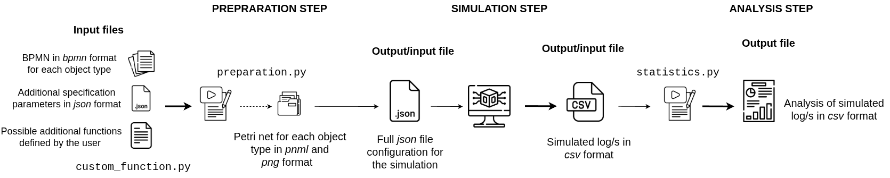
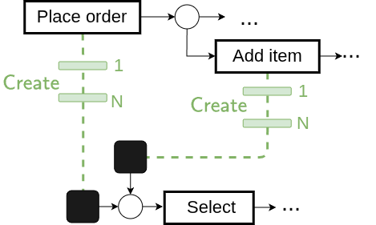
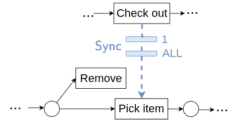
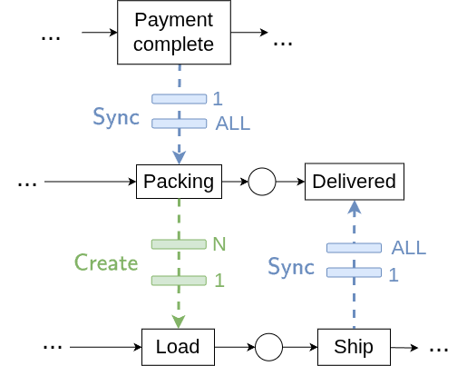

# DORY: Dynamic Object-centric Relations for sYnthetic simulation

Object-centric process mining models real-world scenarios where multiple interdependent objects co-evolve during execution. Unlike traditional case-based approaches, object-centric event logs capture the full complexity of these interactions. However, existing simulation tools fail to capture the dynamic evolution of objects and their interactions, including their creation, modification, removal, and evolving relationships over time. DORY is an object-centric process simulator designed to address these limitations. The system supports multi- object processes where instances are dynamically generated, and removed throughout execution. By combining Petri net–based process definitions with configurable simulation parameters, DORY enables the generation of realistic object-centric event logs for process analysis



Here to see the full documentation, [DORY](https://francescameneghello.github.io/object_centric_simulator/)
## Video
The demonstrattion video is in *docs/images* folder or at the following link [video tutorial](https://francescameneghello.github.io/object_centric_simulator/#video-tutorial).


## Installation guide

To execute this code, use **Python 3.10** and install the following main packages:

* scikit-learn==1.2.1
* scipy==1.11.2
* simpy==4.0.1
* pm4py==2.7.5.2
* statsmodels==0.14.0
* pandas==1.5.3

or you can use the configuration file called requirements.txt to install all specified package versions.

```shell
pip install -r requirements.txt
```
Otherwise, with the anaconda system you can create an environment using the environment.yml specification provided in the repository.
```shell
conda env create -f environment.yml
conda activate dory
```

## Structure 
* `input`: 
    * `experiments`: folder that contains all necessary data to run different experiments. 
        * `o2d`: example folder for the order-2-delivery example. 
            * `bpmn`: folder in which the <ins>user has to upload</ins> the bpmn file for each object type
            * `petrinet`: folder that will store the produced petri net and png inage for each object type
            * `custom_function.py`: <ins>user can specify additional custom rules</ins> for a specific experiment
            * `specification.json`: <ins>user can insert some essential paramters</ins> to realize the input json file for the simulation
    * `preparation.py`: script necesssary to convert bpmn files into petrinet and to costruct the final *input.json* file with the additional specifications 
* `simulation`: code that runs the simulation
* `analysis`
    * `experiments`
        * `o2d`
            * `output_log`: folder that stores the output of the simulation.
            * `output_analysis`: folder automatically created when running *statistics.py* containing general analysis on the simulation
        * `statistics.py`: file to run statistics on single runs or on multiple runs


## Getting Started

### Preparation step
Once the packages are installed, user can: 
1. Upload the bpmn files for each object type into `input/experiments/experiment_name/bpmn`
2. Specify the channels between object types and additional parameters in `specifications.json`
3. Add `custom_function.py` for the experiment

Then to prepare the input json for the simulation, inside `input`:
```shell
python preparation.py experiment_name
```

The `input.json` is created according to the parameters inserted in `specifications.json`. The empty fields of probabilities will be completed with default value, so it is very important that the user checks the parameters inserted in order to have meaningful simulation results. 

### Simulation step
<ins>Inside the simulation folder</ins> you can run one or more simulations by specifying the following parameters in *main* function of *run_simulation.py*.
* `path_parameter`: specify the path to the simulation parameter file, in *json* format
* `name`: name of the process to run
* `n_simulation`: specify the total number of simulation to run

```shell
python run_simulation.py experiment_name
```
An additional parameter is related to the format of the file generated from the simulation. 
By default the simulation produces an OCEL, recording only event-to-object relationships. Optionally, object-to-object relationships can also be logged at each event adopting a snapshot semantics with the additional parameter `snapshot` when running the simulation.


### Analysis 
<ins>Inside analysis folder</ins> you can run `statistics.py` to obtain general statistics on the simulation on a specific experiment. 
```shell
python statistics.py experiment_name
```


## Input files

This document explains how to configure and fix parameters for each object type in the process, for instance *truck, order, item* of the motivating example.

"start_simulation": "YYYY-MM-DD HH:MM:SS" : global start of simulation

Then for each object insert that information:

| Field | Type / Example | Explanation |
|------|----------------|-------------|
| object_name | string (key) | Name of the object, used to distinguish different objects and specify the channel |
| n_objects | int | Number of object indentifiers to generate in the simulation |
| path_petrinet | string (path) | Path to the Petri net associated with this object |
| interTriggerTimer | object / dict | Distribution describing the arrival time of the object in the simulation |
| processing_time | object / dict | Assignment of processing times for all transitions in the Petri net as distribution functions |
| waiting_time | object / dict | Optional assignment of waiting times for transitions in the Petri net as distribution functions |
| resource | object / dict | Resources involved in the execution of this object |
| resource_table | object / dict | Allocation rules between resources and transitions |
| probability | object / dict | Probability associated with each decision point, or *CUSTOM* to define a specific rule in the *custom_function.py* file |
| generator_by | list / array | Indicates if the object is generated by another object; in this case, *interTriggerTimer* and *n_objects* are ignored |
| task_generator | object / dict | Specifies whether any transition can generate another object, including the object type and the distribution used |
| generate | list / array | List of objects type that can be generated |
| object_constraints | object / dict | Specifies synchronization channels, rules, and involved transitions |
| create_relationship | object / dict | Specifies transitions linked to a creation channel that establish relationships |
| destroy_relationship | object / dict | Specifies transitions linked to a channel that remove relationships |


This block defines all configuration parameters for a simulation object, including its creation, timing, resources, behavior, and relationships with other objects; detailed examples and exact usage can be found in the files inside the input_folder.

### Additional specification
Here additional example are provided to simplify the specification of the parameters in the input file. 

1. Create channel 1:N between *order* and *item*. Transition *Place order* and *Add items* spawn new *Items*.

   


    ```python
    "order": {
        "generator_by": [],
        "task_generator": {
            "Place Order": {"obj": "item", "name": "uniform", "parameters": {"low": 2, "high": 3} },
            "Add Item": {"obj": "item", "name": "uniform", "parameters": {"low": 1, "high": 1} }
        }
    },

    "item":{
        "generator_by": ["order"],
    }
    ```
    In this example the dictionary `"generator_by"` belonging to the *order* object is empty, `"task_generator"` refers to the transitions responsible for the "generation" of new object types, in this case the object type *order* instantiates new *items*. 
    The values of both `"Place Order"` and `"Add Item"` keys are dictionaries themselves: `"obj"` refers to the type of objects that will be spawned when the transition is executed; `"name"` is the probability distribution used to decide how many objects to generates, in this case `"uniform"`, with its own `"parameters"`. 

    On the other hand, in the *item* object specification of the input parameters, `"generator_by": ["order"]"`, specifies this create channel between items and order. 

2.  Sync channel 1:ALL between *order* and *item*. 

    

    ```python
    "order": {
        "object_constraints": {"Check out": {"obj": "item", "trans": ["Pick Item", "Remove Item"], "card": "All"}},
    }
    ```
    An order can be checked out only when all its active items have been previously picked. This is represented respectively by the *item* element, the transition `"Pick Item"`,  and the "card" `"All"`, which specifies the cardinality of the channel.

    ```python
    "item":{
        "destroy_relationship": {"Remove Item": "order"}
    }
    ```

    This example also shows the case in which an item is removed from an order. In the *item* specification, the `"destroy_relationship"` field defines which relationships should be removed when a given action is executed. For example, `{"Remove Item": "order"}` means that executing the *Remove Item* action will destroy the relationship between *item* and *order*.
    
3. Sync and create channels between *order*, *item*, and *truck*

    

    This example collects some new elements and some already explained previously. In particular, as soon as the payment of the order is confirmed, the item proceeds with the packing and delivery by trucks.

    ```python 
    "item":{
        "object_constraints": {
            "Packing": {"obj": "order", "trans": ["Payment Complete"], "card": "All"},
            "Delivered": {"obj": "truck", "trans": ["Ship"], "card": "All"}
        }
    }
    ```

    The truck ships the items it has loaded. Once the shipment is complete, two things happen: the *Delivered* transition is fired in the item process, and the relationship between *item* and *truck* is destroyed.

    ```python 
    "truck": {
        "object_constraints": {"Load": {"obj": "item", "trans": ["Packing"], "card": [10,20] }},
        "create_relationship": {"Load": "item"},
        "destroy_relationship": {"Ship": "item"}
    }
    ```
    The `"object_constraints"` refers to the *Load* transition that has to be executed on *item* objects that has to be packed. The parameters represent the minimun number of items to be loaded onto the truck (10) and the capacity of the truck (20). 
